

# OnO · 손쉽게 작성하는 나만의 AI 오답노트

**틀린 문제를 찍어 두면, 복습까지 알아서 이어집니다.**

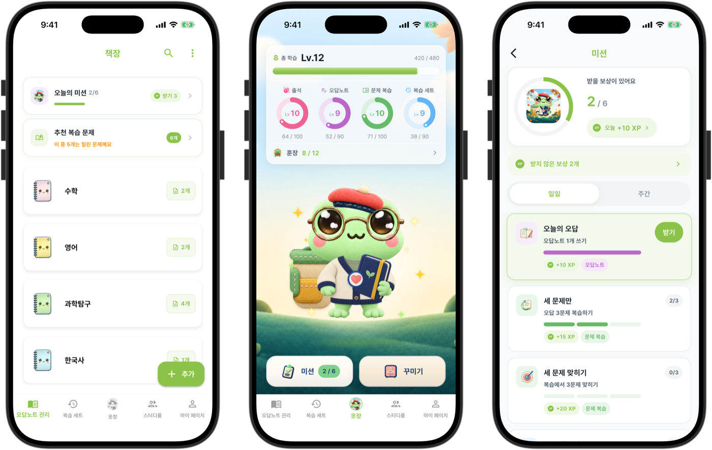

 

## 왜 OnO 인가요

오답노트가 좋다는 것은 다들 알지만, 막상 쓰려고 하면 막히는 곳이 정해져 있습니다.

| 이런 게 번거로웠다면 | OnO 는 이렇게 합니다 |
| --- | --- |
| 문제와 출처를 옮겨 적는 데 시간이 오래 걸립니다 | 사진으로 찍어 올리면 한 장이 완성됩니다 |
| 과목별 오답노트를 들고 다니기 무겁습니다 | 휴대폰과 태블릿에서 같은 계정으로 이어집니다 |
| 내 오답 분석이 맞는지 모르겠습니다 | AI 가 과목과 문제 유형, 자주 하는 실수를 짚어 줍니다 |
| 복습할 문제를 다시 찾기 번거롭습니다 | 태그와 공책으로 정리하고, 복습할 때가 되면 먼저 모아 줍니다 |
| 다시 풀려면 문제집을 또 사야 합니다 | 문제 이미지 위에 바로 필기해서 다시 풉니다 |
| 혼자 하면 오래 못 갑니다 | 미션과 훈장, 스터디룸이 계속하게 만듭니다 |

 

## 4.1.0 에서 새로 생긴 것

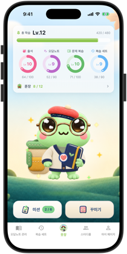
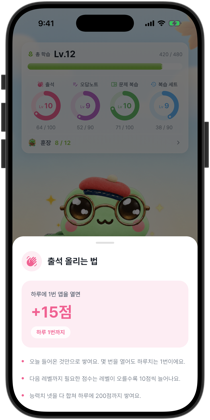
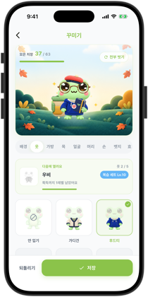
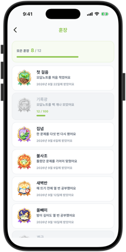
 
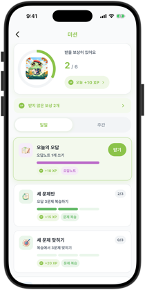
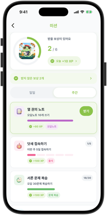
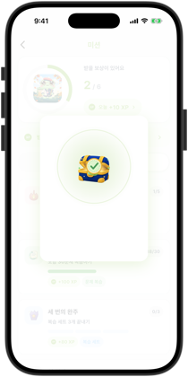
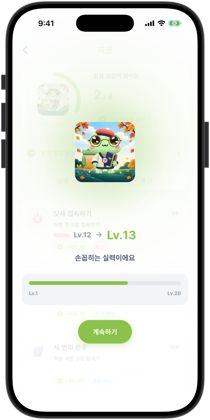

- **옷장** — 하단 가운데 개구리 탭에서 총 학습 레벨과 출석, 오답노트, 문제 복습, 복습 세트 네 가지 능력치를 봅니다.
- **꾸미기** — 레벨을 올리면 배경과 옷, 가방, 모자 같은 치장 63종이 하나씩 열립니다. 입어 보고 마음에 들면 저장합니다.
- **미션** — 일일 미션 6개와 주간 미션 4개가 매일, 매주 새로 시작됩니다. 다 채우면 보상 상자가 열리고 경험치가 들어옵니다.
- **훈장** — 오답노트를 처음 적은 날부터 한 문제를 다섯 번 다시 본 날까지, 공부한 기록이 훈장 12종으로 남습니다.
- **카메라 개선** — 보이는 그대로 찍히도록 촬영 화면을 다시 그렸고, 여러 장을 이어 찍을 수 있습니다.

 

## 주요 기능

### 1. 소셜 로그인하고 둘러보기

구글과 애플, 카카오 계정으로 바로 시작합니다. 처음 로그인하면 공책부터 학습 리포트까지 일곱 단계로 짧게 안내해 드립니다.

| 로그인 | 안내 시작 | 공책과 오답노트 | 레벨과 성장 |
| --- | --- | --- | --- |
| 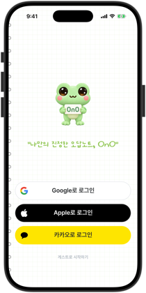 | 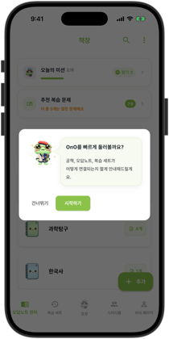 | 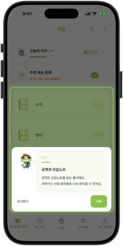 | 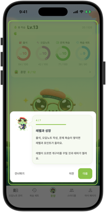 |

### 2. 오답노트 작성하기

푼 날짜와 공책을 고르고 문제와 해설 사진을 올립니다. 제목과 태그, 메모까지 채우면 한 장이 끝납니다. 여러 장을 한 번에 올려 연달아 등록할 수도 있습니다.

| 추가 메뉴 | 작성 화면 | 제목과 태그, 메모 | 태그 고르기 |
| --- | --- | --- | --- |
| 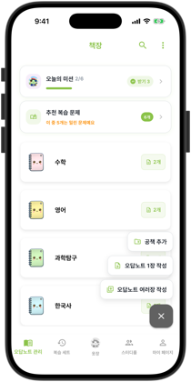 | 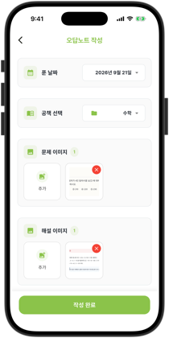 | 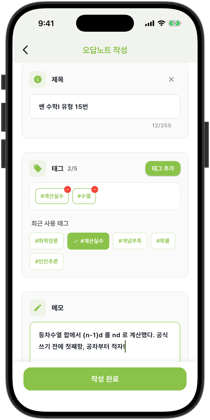 | 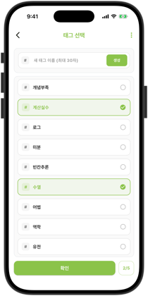 |

### 3. 책장으로 정리하고 태그로 찾기

공책 안에 또 공책을 두어 과목과 단원으로 나눕니다. 태그나 제목으로 검색하면 원하는 문제가 바로 나오고, 복습할 때가 된 문제는 추천 복습 문제가 먼저 모아 줍니다.

| 책장 | 공책 안 | 태그로 검색 | 추천 복습 문제 |
| --- | --- | --- | --- |
| 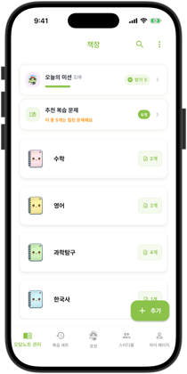 | 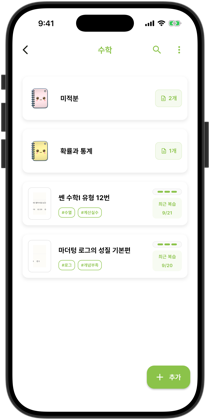 | 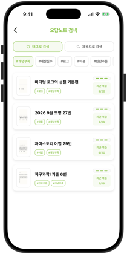 | 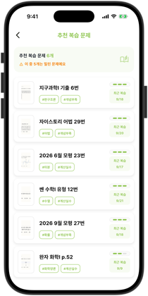 |

### 4. 자세히 보기와 AI 오답분석

오답노트는 문제, 정답, 복습 기록 세 탭으로 나뉩니다. 정답 탭 아래에서 AI 가 분석한 과목과 문제 유형, 풀이, 자주 하는 실수, 학습 팁을 확인합니다.

| 문제 | 정답 | 태그와 메모 | AI 오답분석 |
| --- | --- | --- | --- |
| 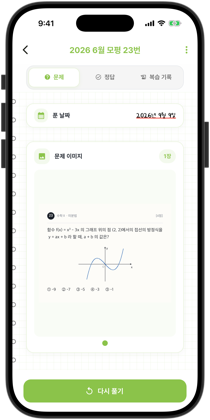 | 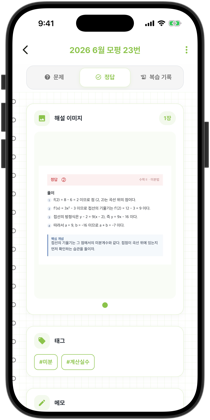 | 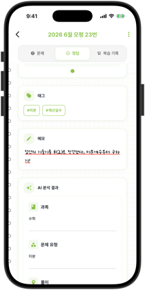 | 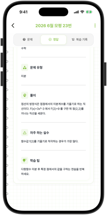 |

### 5. 앱에서 바로 다시 풀기

종이에 푼 풀이를 사진으로 올리거나, 문제 이미지 위에 바로 필기해서 풉니다. 풀이 시간은 저절로 기록되고, 회차마다 오답인지 정답인지와 그때의 소감이 쌓입니다.

| 방식 고르기 | 필기해서 풀기 | 복습 기록 | 회차 자세히 |
| --- | --- | --- | --- |
| 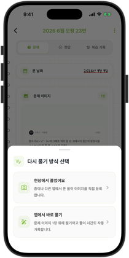 | 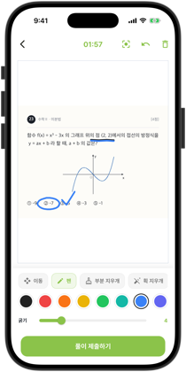 | 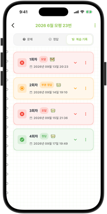 | 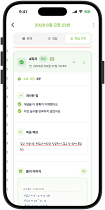 |

### 6. 복습 세트로 시험 준비하기

복습할 문제를 묶어 두면 등록한 순서나 셔플 모드로 한 번에 돌려 봅니다. 마치고 나면 이번 복습이 어땠는지 이모지로 남깁니다.

| 세트 목록 | 세트 상세 | 복습 진행 | 복습 완료 |
| --- | --- | --- | --- |
| 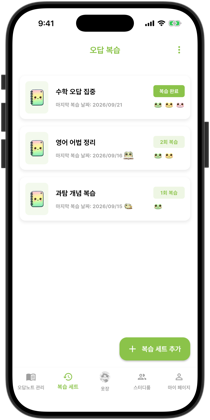 | 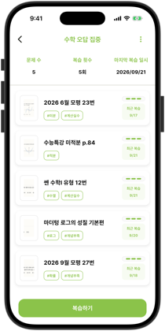 | 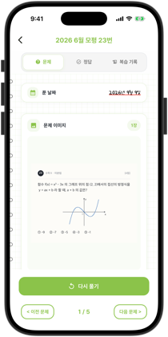 | 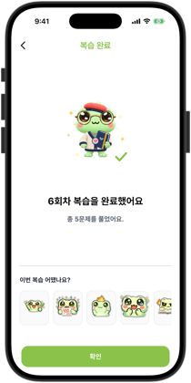 |

### 7. 스터디룸에서 함께 공부하기

친구들과 방을 만들면 이번 주 누가 얼마나 공부했는지 랭킹으로 보입니다. 함께 채우는 챌린지를 걸고, 어려웠던 문제를 공유해 댓글과 이모지로 이야기합니다.

| 스터디룸 목록 | 랭킹 | 챌린지 |
| --- | --- | --- |
| 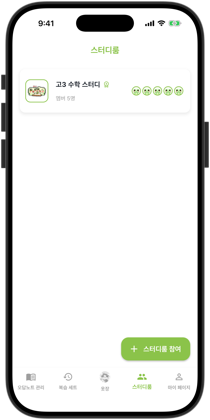 | 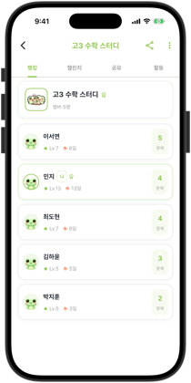 | 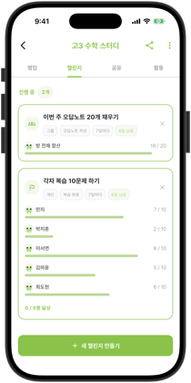 |

| 문제 공유 | 댓글과 반응 | 활동 |
| --- | --- | --- |
| 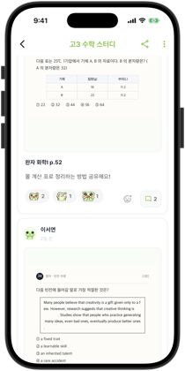 | 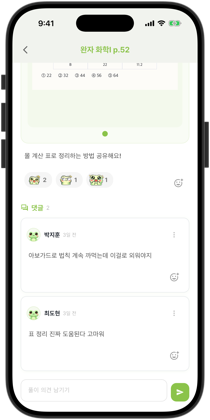 | 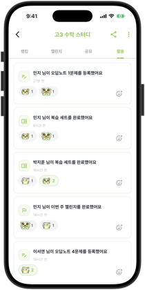 |

### 8. 나의 성장 확인하기

학습 달력에는 공부한 날마다 내 개구리 도장과 그날의 기분이 찍힙니다. 학습 리포트에서 복습 추이와 약점을 확인하고, 이번 주 기록은 성취 카드로 만들어 친구에게 보냅니다.

| 마이 페이지 | 학습 달력 | 학습 리포트 | 학습 성취 카드 |
| --- | --- | --- | --- |
| 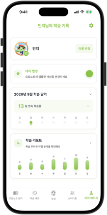 | 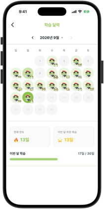 | 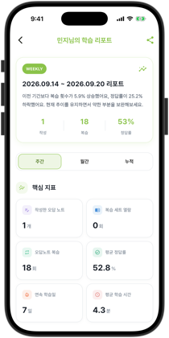 | 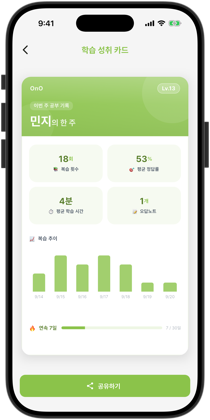 |

### 9. 그 밖에

| 기능 | 설명 | 화면 |
| --- | --- | --- |
| 개구리 꾸미기 | 열 자리(배경, 옷, 가방, 목, 얼굴, 머리, 손, 뱃지, 효과, 프레임)에 치장을 입힙니다. 잠긴 것에는 어떤 능력치를 몇 레벨까지 올려야 열리는지 적혀 있습니다. | 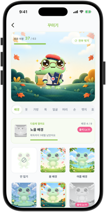 |
| 프로필 테두리 | 프레임 자리의 치장은 개구리가 아니라 프로필 사진 둘레에 둘러집니다. | 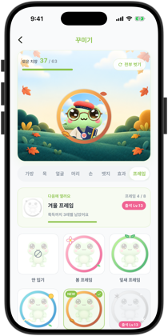 |
| 테마 변경 | 능력치 레벨이 3, 6, 9, 12, 15가 될 때마다 색이 하나씩 열려 모두 24가지가 됩니다. | 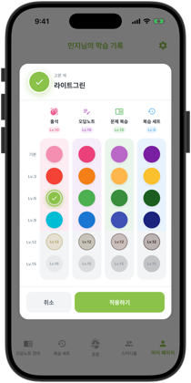 |
| 복습 알림 | 복습 세트에 알림 시간을 걸어 두면 정해진 시간에 알려 줍니다. 설정에서 끌 수 있습니다. | 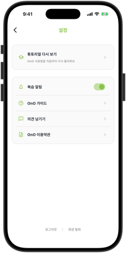 |

 

## 기술 스택

| 구분 | 사용 기술 |
| --- | --- |
| 앱 | Flutter 3.3+, Dart 3.3+ |
| 상태 관리 | Provider |
| 네트워크 | http, 앱 버전 헤더와 토큰 재발급을 거치는 자체 `HttpService` |
| 인증 | Google, Apple, Kakao 소셜 로그인, JWT (`flutter_secure_storage` 보관) |
| 이미지 | camera, cunning_document_scanner, image_picker, image_cropper |
| 알림 | Firebase Messaging, flutter_local_notifications |
| 지표와 모니터링 | Firebase Analytics, Sentry |
| 수식과 그래픽 | flutter_tex, flutter_svg, cached_network_image |

서버는 Spring Boot 로 만들었고 저장소가 따로 있습니다. [AI-SIP/OnO_BACKEND](https://github.com/AI-SIP/OnO_BACKEND)

 

## 업데이트 내역

| 날짜 | 버전 | 내용 |
| --- | --- | --- |
| 2026/9 | v4.1.0 | 옷장과 개구리 꾸미기 추가 · 일일/주간 미션 추가 · 훈장 12종 추가 · 카메라 촬영 화면 개선과 여러 장 이어 찍기 · 이미지 좌우로 넘겨 보기 · 태블릿 화면 대응 |
| 2026/6 | v4.0.0 | 스터디룸 추가 · 문제 공유와 댓글, 이모지 반응 · 챌린지와 랭킹 · 프로필 이미지와 폴더 정리 개선 |
| 2026/5 | v3.6.0 | 오답노트 여러 장 한 번에 등록 · 학습 성취 카드 공유 · 학습 달력 · 마이페이지 개편 |
| 2026/5 | v3.5.0 | 앱에서 바로 푸는 필기 화면 · 복습 세트와 문제 선택 화면 개선 · 추천 복습 문제 개선 |
| 2026/3 | v3.4.0 | 태그 도입 · 오답노트 검색 · 작성과 상세, 복습 화면 디자인 개선 |
| 2026/3 | v3.3.0 | 학습 리포트 도입 |
| 2026/2 | v3.2.0 | 복습 기록 도입 · 대규모 디자인 개선 |
| 2026/1 | v3.1.0 | OnO 캐릭터 성장 도입 · 오답노트 등록 로딩 시간 감소 |
| 2026/1 | v3.0.0 | 레벨 도입 · 복습 알림 도입 · 이미지 등록 편의성 개선 |

2024년 기록 더 보기

| 날짜 | 버전 | 내용 |
| --- | --- | --- |
| 2024/11 | v2.4.0 | 복습 리스트 도입 |
| 2024/10 | v2.3.0 | 필기 제거 방식 개선 · 캐릭터 아이콘 추가 |
| 2024/10 | v2.2.0 | 노트와 템플릿 캐릭터 도입 · UI/UX 대규모 개선 |
| 2024/10 | v2.1.0 | 오답노트 디자인 개선 · 공책 도입 |
| 2024/10 | v2.0.0 | AI 오답분석 도입 · 과목별 템플릿 도입 · UI 대규모 수정 |
| 2024/9 | v1.3.2 | 구글 플레이 스토어 출시 · 오답노트 관리와 닉네임 설정 도입 |
| 2024/8 | v1.0.0 | 앱 스토어 출시 · 오답 등록과 복습, 파란색 필기 제거 |

 

## 출시 예정

- **채점 기능** — 정답과 비교해 채점합니다. 힌트를 열어 보면 틀린 것으로 칩니다.
- **오답 통계 확장** — 교과과정 단원별로 내 오답 현황을 더 잘게 나눠서 보여 드립니다.

 

## 피드백

| 방법 | 링크 |
| --- | --- |
| 설문조사 | [의견 남기기](https://forms.gle/MncQvyT57LQr43Pp7) |
| App Store 리뷰 | [오노(OnO) - 손쉬운 나만의 오답노트](https://apps.apple.com/kr/app/오노-ono-손쉬운-나만의-오답노트/id6602886624) |
| Google Play 리뷰 | [오노(OnO) - 손쉬운 나만의 오답노트](https://play.google.com/store/apps/details?id=com.ono.app&pcampaignid=web_share) |
| 이메일 | ono.dev.team@gmail.com |

스토어 리뷰는 공개되니, 개인정보가 들어가는 이야기는 설문조사나 이메일로 보내 주세요.

 
© AI-SIP · OnO

